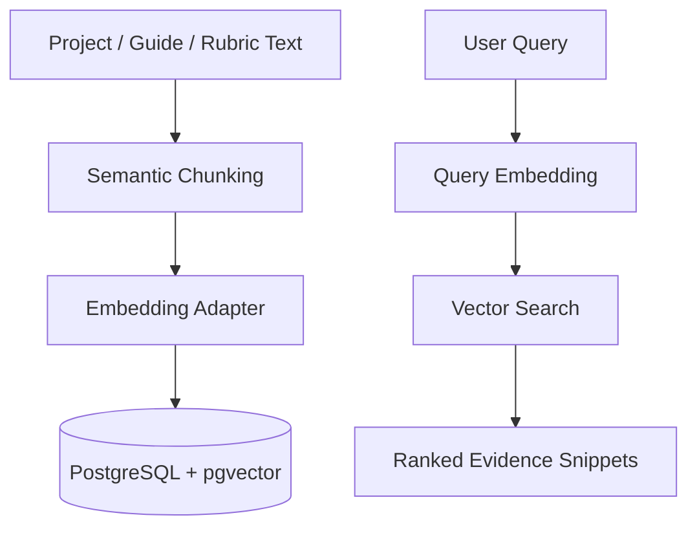

# AI Architecture v2: Academic RAG Foundation

## Objective

Upgrade CapstoneHub from an explainable rule-based assistant to an Academic RAG assistant while preserving the current baseline for research comparison.

## Initial Implementation Layer

This first implementation adds the storage and retrieval foundation:

## Current Embedding Adapter

The embedding adapter supports two modes:

- `hashing-vectorizer-768`: stable local fallback.
- Any `sentence-transformers` model configured through `EMBEDDING_MODEL`.

The Docker runtime installs the lightweight fallback by default. Install `ai-service/requirements-ml.txt` only when running real embedding/reranking/fine-tuning experiments.

The fallback is not the final research model; it is an infrastructure-safe adapter that lets the project:

- Create pgvector rows.
- Test vector indexing.
- Build backend/frontend integration.
- Compare search flow before adding heavier models.

The adapter is intentionally replaceable. The next version should use:

- `intfloat/multilingual-e5-base`, or
- `intfloat/multilingual-e5-large`, or
- a fine-tuned Arabic/multilingual academic embedding model.

## Reranking Layer

The retrieval pipeline supports reranking:

- If `RERANKER_MODEL` is set, a `sentence-transformers` CrossEncoder is loaded lazily.
- If no reranker is configured, the system uses a weighted fallback:
  - vector similarity
  - lexical overlap with the query

## LLM Layer

The RAG endpoint supports an optional synthesis layer:

- `LLM_PROVIDER=disabled`: template-based grounded synthesis.
- `LLM_PROVIDER=openai`: evidence-grounded LLM synthesis if `OPENAI_API_KEY` is available.

If the LLM call fails, the endpoint returns the retrieval-grounded fallback answer and records the error.

## New Tables

- `ai_documents`: one record per indexed source.
- `ai_chunks`: chunk text plus vector embedding and metadata.
- `ai_model_runs`: model/pipeline execution tracking for research reproducibility.

## New FastAPI Endpoints

- `POST /semantic/index-text`
  - Ingest raw text.
  - Chunk text.
  - Generate embeddings.
  - Store chunks in pgvector.

- `POST /semantic/index-document`
  - Extract text from PDF/DOCX.
  - Chunk and embed the extracted content.
  - Store submission/document chunks in pgvector.

- `POST /semantic/search`
  - Embed a query.
  - Search chunks using cosine distance.
  - Return ranked evidence snippets.

- `POST /rag/answer`
  - Search for relevant chunks.
  - Build a retrieval-grounded answer.
  - Store the model run for research tracking.

- `POST /academic/analyze-document`
  - Extract text from PDF/DOCX or raw text.
  - Produce an academic structure report.
  - Score section coverage, citations, heading quality, content depth, and figures/tables.

- `POST /academic/plagiarism-check`
  - Compare a submitted document against indexed chunks.
  - Use normalized word shingles, Jaccard similarity, and deterministic MinHash estimates.

- `POST /academic/classify-section`
  - Classifies academic section quality.
  - Runtime uses a heuristic baseline until a trained model is available.
  - Training code exists in `ai-service/train_section_classifier.py`.

- `POST /evaluation/rag-benchmark`
  - Runs retrieval benchmark v2.
  - Reports Precision@K, MRR, and NDCG.

## New Express API Routes

- `POST /api/ai/semantic/index-project/:projectId`
  - Index one project that the current supervisor/admin can access.

- `POST /api/ai/semantic/reindex-projects`
  - Index a batch of projects.
  - Body examples:
    - `{ "limit": 50 }`
    - `{ "archivedOnly": true, "limit": 100 }`
    - `{ "activeOnly": true, "limit": 25 }`

- `POST /api/ai/semantic-search`
  - Body: `{ "query": "AI graduation project recommendation", "topK": 5 }`

- `POST /api/ai/semantic/index-submission/:submissionId`
  - Indexes an uploaded PDF/DOCX submission into the vector store.

- `POST /api/ai/semantic/index-rubrics`
  - Indexes active rubric templates into the vector store.

- `POST /api/ai/rag-answer`
  - Body: `{ "query": "How can I make my project idea more novel?", "topK": 5, "task": "novelty" }`

- `POST /api/ai/academic/analyze-submission/:submissionId`
  - Runs the v2 academic structure analyzer on a submitted PDF/DOCX file.

- `POST /api/ai/academic/plagiarism-submission/:submissionId`
  - Runs internal similarity checking against indexed archived projects by default.

- `POST /api/ai/academic/classify-section`
  - Classifies academic section quality.

- `POST /api/ai/evaluation/rag-benchmark`
  - Runs RAG retrieval benchmark v2 for supervisor/admin dashboards.

## Manual Test Flow

1. Start PostgreSQL, backend, and AI service.
2. Reindex projects:
   - `POST /api/ai/semantic/reindex-projects`
3. Run semantic search:
   - `POST /api/ai/semantic-search`
4. Run RAG answer:
   - `POST /api/ai/rag-answer`

The current RAG answer uses template-based grounded synthesis by default. If an LLM provider is configured, the same retrieved evidence is passed to the LLM while preserving fallback behavior.

## Next Architecture Steps

1. Run Docker and perform end-to-end indexing/search tests.
2. Switch `EMBEDDING_MODEL` to `intfloat/multilingual-e5-base` for semantic evaluation.
3. Configure a CrossEncoder reranker and compare Precision@K.
4. Collect labeled section-quality data from supervisors.
5. Train the section classifier and compare it against the heuristic baseline.
6. Expand the benchmark dataset with real anonymized university cases.
