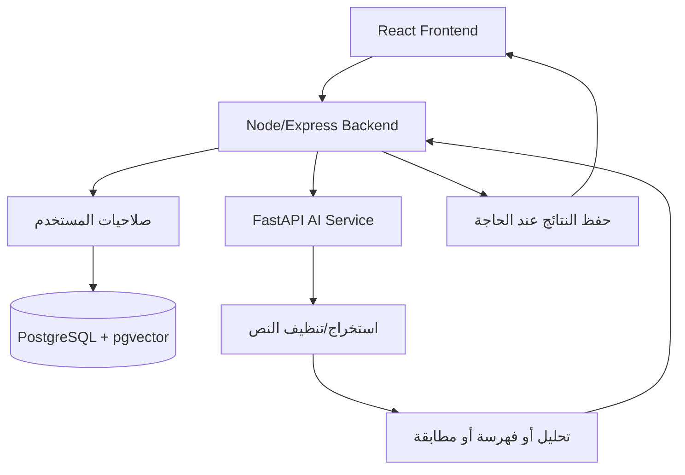

# مرجع شرح خدمة الذكاء الاصطناعي في CapstoneHub

هذا الملف مكتوب كمرجع للشرح أمام الدكتورة. الفكرة الأساسية: الذكاء الاصطناعي في CapstoneHub ليس زر واحد أو API خارجي فقط، بل هو طبقة خدمات كاملة تساعد الطالب والمشرف والإدارة في فهم فكرة المشروع، تقييم الملفات، فحص التشابه، اقتراح المشرفين، توليد Blueprint، واستشعار مخاطر التأخر.

## ملخص سريع للشرح

خدمة الذكاء الاصطناعي في المشروع مبنية على طبقتين:

1. **خدمة Python مستقلة باسم `ai-service`**
   - مبنية بـ FastAPI.
   - مسؤولة عن التحليل النصي، RAG، الفهرسة الدلالية، فحص التشابه، تحليل ملفات PDF/DOCX، المطابقة، والخطر.
   - تعمل داخل Docker على المنفذ `8000`.

2. **طبقة Backend في Node/Express**
   - تستقبل طلبات الواجهة.
   - تتحقق من صلاحيات المستخدم.
   - تجمع البيانات من PostgreSQL.
   - تستدعي خدمة الذكاء الاصطناعي.
   - تحفظ النتائج في الجداول المناسبة.

بهذا التصميم عزلنا الذكاء الاصطناعي عن باقي النظام، فصار من السهل تطويره لاحقاً أو تبديل نموذج الـ embeddings أو إضافة LLM بدون كسر الواجهة.

## لماذا فصلنا الذكاء الاصطناعي كخدمة مستقلة؟

فصل الخدمة يعطينا:

- استقلالية تقنية: Python أفضل لمكتبات الذكاء الاصطناعي وNLP.
- وضوح معماري: Backend مسؤول عن الصلاحيات والبيانات، وAI Service مسؤولة عن التحليل.
- قابلية تطوير: يمكن لاحقاً استبدال `hashing-vectorizer-768` بنموذج أقوى مثل multilingual E5.
- قابلية اختبار: كل Endpoint في AI Service قابل للاختبار لوحده.
- أمان: الواجهة لا تتصل مباشرة بخدمة AI، بل تمر عبر Backend يتحقق من الصلاحيات.

## المسار العام للطلب



مثال: عندما يرفع الطالب ملف أطروحة:

1. الطالب يرفع PDF أو DOCX.
2. Backend يتحقق أن الطالب يملك صلاحية الملف.
3. Backend يقرأ الملف ويرسله Base64 إلى `ai-service`.
4. `ai-service` يستخرج النص ويحلله.
5. Backend يحفظ النتيجة في جدول `ai_document_analyses`.
6. الواجهة تعرض الجاهزية، الملاحظات، التوصيات، ومخططات Mermaid.

## التقنيات المستخدمة

### Backend AI Service

- **FastAPI** لبناء REST API سريع.
- **Pydantic** لتعريف شكل الطلبات والتحقق منها.
- **scikit-learn** لحساب TF-IDF وCosine Similarity وHashing Vectorizer.
- **NumPy** للحسابات الرقمية.
- **pypdf** لاستخراج النص من ملفات PDF.
- **python-docx** لاستخراج النص من ملفات DOCX.
- **psycopg** للاتصال بـ PostgreSQL من Python.
- **pgvector** لتخزين embeddings والبحث بالمسافة الكوساينية.

### قاعدة البيانات

- PostgreSQL.
- إضافة `vector`.
- جداول خاصة بالذكاء:
  - `ai_documents`
  - `ai_chunks`
  - `ai_model_runs`
  - `ai_document_analyses`
  - `assistant_feedback`
  - `project_blueprints`

## كيف تعمل الفهرسة الدلالية و RAG؟

RAG تعني Retrieval-Augmented Generation. في مشروعنا معناها:

1. نفهرس نصوص المشاريع أو الملفات أو rubrics.
2. نقسم النص إلى مقاطع صغيرة.
3. نحول كل مقطع إلى embedding.
4. نخزن المقاطع والـ embeddings في PostgreSQL/pgvector.
5. عندما يسأل المستخدم، نحول سؤاله إلى embedding.
6. نبحث عن أقرب المقاطع.
7. نرجع إجابة مبنية على الأدلة المسترجعة.

المهم: الإجابة لا تكون “تخميناً”، بل مربوطة بأدلة تظهر للمستخدم.

### تقسيم النصوص إلى Chunks

الملف المسؤول: `ai-service/chunking.py`

المنطق:

- تنظيف النص من الفراغات الزائدة.
- محاولة الحفاظ على عناوين أكاديمية مثل:
  - abstract
  - introduction
  - methodology
  - results
  - references
  - ملخص
  - مقدمة
  - منهجية
  - نتائج
  - المراجع
- تقسيم النص إلى مقاطع بحد تقريبي `750` كلمة مع overlap حوالي `120` كلمة.
- تخزين metadata لكل chunk مثل اسم القسم.

هذا يساعد البحث الدلالي أن يرجع مقاطع صغيرة مفهومة بدل ملف كامل طويل.

### توليد Embeddings

الملف المسؤول: `ai-service/embeddings.py`

حالياً يوجد adapter يدعم وضعين:

1. **الوضع المحلي الافتراضي**
   - اسمه `hashing-vectorizer-768`.
   - لا يحتاج تحميل موديل من الإنترنت.
   - يولد vector بطول 768.
   - مناسب للديمو والبنية التحتية والاختبار.

2. **وضع نماذج sentence-transformers**
   - إذا وضعنا `EMBEDDING_MODEL` باسم موديل حقيقي.
   - يمكن لاحقاً استخدام `intfloat/multilingual-e5-base` أو نموذج عربي/متعدد اللغات.

النقطة المهمة للشرح: صممنا adapter قابل للاستبدال. يعني المشروع حالياً يعمل محلياً، لكنه جاهز بحثياً لاستبدال نموذج الـ embeddings بنموذج أقوى.

### التخزين في pgvector

الملف المسؤول: `ai-service/vector_store.py`

الجداول:

- `ai_documents`: يمثل مصدر كامل مثل مشروع مؤرشف أو ملف طالب أو Rubric.
- `ai_chunks`: يمثل المقاطع المستخرجة من كل مصدر، ومعها embedding.
- `ai_model_runs`: يسجل تشغيلات الموديلات والـ pipelines لأغراض التتبع البحثي.

البحث يتم باستخدام:

```sql
c.embedding <=> query_embedding
```

وهي مسافة cosine في pgvector. كلما كانت المسافة أقل، كان التشابه أعلى.

### Reranking

الملف المسؤول: `ai-service/reranking.py`

بعد البحث الأولي، لدينا خطوة إعادة ترتيب:

- إذا كان `RERANKER_MODEL` موجوداً، يمكن استخدام CrossEncoder.
- إذا لم يكن موجوداً، نستخدم fallback مفهوم:
  - 72% من درجة التشابه الدلالي.
  - 28% من التطابق اللفظي بين كلمات السؤال والمقطع.

هذا يحسن ترتيب النتائج ويجعلها أكثر تفسيراً.

### بناء إجابة RAG

الملف المسؤول: `ai-service/rag.py`

الخدمة لا ترجع فقط نصاً عاماً. ترجع:

- answer
- confidence
- evidence
- quality_gates
- retrieval_stats
- recommendations
- missing_information

درجة الثقة لا تأتي عشوائياً. يتم حسابها من:

- أعلى similarity.
- متوسط أفضل 3 نتائج.
- تغطية كلمات السؤال داخل الأدلة.
- تنوع المصادر.
- عدد الأدلة المتاحة.

إذا لم توجد أدلة كافية، الخدمة تقول ذلك صراحة.

## هل نستخدم LLM خارجي؟

الملف المسؤول: `ai-service/llm_adapter.py`

النظام يدعم وضعين:

1. `LLM_PROVIDER=disabled`
   - الوضع الافتراضي.
   - الإجابة تكون template-based grounded synthesis.
   - لا يحتاج إنترنت أو مفتاح API.

2. `LLM_PROVIDER=openai`
   - اختياري فقط.
   - إذا وجد `OPENAI_API_KEY`، نرسل الأدلة المسترجعة إلى LLM.
   - التعليمات تطلب منه الإجابة بالعربية وبناء الادعاءات فقط على الأدلة.

إذا فشل LLM، النظام لا يتوقف. يرجع fallback مبني على الأدلة.

النقطة المهمة: المشروع ليس معتمداً كلياً على LLM خارجي. عنده RAG محلي يعمل حتى بدون LLM.

## خدمات الذكاء الاصطناعي الموجودة

### 1. المساعد الشخصي للطالب والمشرف والإدارة

المسار في Backend: `POST /api/features/assistant`

هذا المساعد موجود داخل مكوّن المحادثة. وظيفته:

- يفهم سؤال المستخدم حسب دوره.
- الطالب يستطيع سؤاله عن مشروعه، مشرفه، مراحله، وملفاته.
- المشرف يستطيع سؤاله عن طلابه والمقترحات.
- الإدارة تستطيع سؤاله عن إحصائيات النظام والمشاكل.
- إذا كتب الطالب فكرة مشروع، يبدأ جلسة متطلبات.
- إذا كانت الفكرة كافية، يولد Blueprint.

الملف الأساسي: `backend/src/routes/features.js`

### 2. توليد Blueprint للمشروع

المسارات:

- `POST /api/features/project-blueprint`
- `POST /api/features/project-blueprint/project/:projectId`

الـ Blueprint يحتوي:

- المجال المتوقع للمشروع.
- Actors.
- الجداول المقترحة.
- العلاقات.
- الصفحات.
- API endpoints.
- Mermaid diagrams.
- خطة MVP.
- مخاطر تقنية.
- أسئلة دفاع.
- افتراضات وأسئلة توضيحية.
- qualityScore و confidence.

الهدف ليس إعطاء تصميم نهائي، بل تصميم أولي يساعد الطالب والمشرف على النقاش.

### 3. فحص تشابه فكرة المشروع

المسار:

- `POST /api/ai/concept-check`

المنطق:

- يجمع عنوان المشروع والوصف والتقنيات.
- يقارنها مع المشاريع المؤرشفة.
- يستخدم TF-IDF على مستوى الكلمات والحروف مع Cosine Similarity.
- يرجع:
  - duplicate_risk: low / medium / high
  - max_similarity
  - matches
  - recommendations

إذا كان التشابه مرتفعاً، ينصح الطالب بكتابة فقرة novelty أو تغيير نطاق الفكرة.

### 4. اقتراح مشرفين مناسبين

المسارات:

- `POST /api/ai/match/:studentId`
- `POST /api/ai/advanced-match`
- `GET /api/features/supervisor-suggestions`

النسخة المتقدمة تأخذ:

- عنوان المشروع.
- الوصف.
- التقنيات.
- خبرات المشرف.
- لغاته وأدواته.
- مشاريعه السابقة.
- السعة الحالية وعدد الطلاب لديه.

درجة المطابقة تعتمد على:

- التشابه الدلالي.
- الكلمات/التقنيات المشتركة.
- توفر المشرف أو ضغطه الحالي.
- shared keywords.

وترجع تفسيراً واضحاً: لماذا هذا المشرف مناسب.

### 5. اقتراح شركاء للفريق

ضمن `POST /api/ai/advanced-match`

لا يرشح المشرفين فقط، بل يقترح زملاء محتملين:

- حسب اهتمامات الطالب.
- المهارات المشتركة.
- المهارات المكملة.
- قرب ملف الطالب من فكرة المشروع.

هذا مفيد إذا كان المشروع يحتاج فريقاً أو توزيع أدوار.

### 6. توليد Roadmap للمشروع

المسار:

- `POST /api/ai/roadmap`

المنطق:

- يستنتج نوع المشروع:
  - web
  - mobile
  - ai
  - iot
  - general
- يقسم مدة المشروع إلى مراحل.
- يعطي لكل مرحلة:
  - start week
  - end week
  - title
  - tasks
  - deliverable
- يضيف مخاطر عامة مثل اتساع النطاق وتأخر الاختبار.

### 7. تحليل ملفات الأطروحة

المسار:

- `POST /api/ai/analyze-submission/:submissionId`

يدعم:

- PDF
- DOCX

النتيجة:

- عدد الكلمات.
- نسبة الجاهزية.
- الأقسام المكتشفة.
- ملاحظات لغوية بسيطة.
- توصيات.
- Mermaid diagrams مقترحة:
  - flowchart
  - use case
  - sequence
  - ERD

هذا يساعد الطالب يعرف هل ملفه ناقص قبل مراجعة المشرف.

### 8. التحليل الأكاديمي المتقدم

المسار:

- `POST /api/ai/academic/analyze-submission/:submissionId`

الملف المسؤول: `ai-service/academic_analyzer.py`

يفحص:

- تغطية الأقسام الأكاديمية.
- جودة الاستشهادات.
- وجود قسم مراجع.
- بنية العناوين.
- عمق المحتوى حسب عدد الكلمات.
- وجود أشكال وجداول.

ويرجع:

- overall_academic_score
- rubric
- missing_sections
- citations
- headings
- recommendations

هو deterministic analyzer، أي قابل للتفسير، ويمكن مقارنته لاحقاً مع نموذج تعلم آلي.

### 9. تقييم الأطروحة بشكل Rubric

المسار:

- `POST /api/ai/grade-submission/:submissionId`

يعطي:

- overall_grade
- formatting_and_references
- structure
- content_depth
- language_quality
- detected sections
- recommendations

مهم جداً: هذا ليس علامة نهائية، بل قراءة مساعدة قبل تقييم المشرف.

### 10. تقييم المقترح

المسار:

- `POST /api/ai/score-proposal/:projectId`

يفحص المقترح من ناحية:

- وضوح المشكلة.
- وجود حل أو منهجية.
- عناصر SMART objectives.
- وجود مراجع.
- كفاية مراجعة الأدبيات.
- منطق المنهجية.

ويرجع نقاط ضعف واضحة.

### 11. فحص التشابه الداخلي للملفات

المسار:

- `POST /api/ai/academic/plagiarism-submission/:submissionId`

الملف المسؤول: `ai-service/plagiarism.py`

الطريقة:

- تطبيع النص العربي والإنكليزي.
- تحويل النص إلى word shingles.
- حساب Jaccard similarity.
- حساب MinHash deterministic estimate.
- مقارنة الملف مع chunks مفهرسة من مشاريع مؤرشفة أو مصادر أخرى.

النتيجة:

- similarity_level: none / low / medium / high
- max_similarity
- matches
- risk_score لكل match

ملاحظة مهمة للشرح: هذا ليس نظام كشف انتحال رسمي، بل فحص تشابه داخلي مساعد داخل بيانات المنصة.

### 12. البحث الدلالي

المسار:

- `POST /api/ai/semantic-search`

الاستخدام:

- البحث داخل المشاريع والملفات والـ rubrics المفهرسة.
- إرجاع أدلة مرتبة حسب similarity و rerank_score.
- يساعد الطالب والمشرف في إيجاد مشاريع أو أجزاء قريبة من سؤال معيّن.

### 13. إجابة RAG مع أدلة

المسار:

- `POST /api/ai/rag-answer`

ترجع:

- answer
- confidence
- evidence
- recommendations
- retrieval_stats

وفي Backend لدينا fallback إضافي:

- إذا ثقة RAG قليلة أو لا توجد أدلة كافية، يبحث Backend مباشرة في جدول `projects`.
- يستبعد بيانات الاختبار والعناوين المشوشة.
- يدمج الأدلة ويزيد قابلية الشرح.

هذا مهم لأنه يجعل المساعد مرتبطاً ببيانات المشروع الحقيقية وليس فقط vector index.

### 14. لوحة مخاطر التأخر

المسارات:

- `POST /api/ai/risk/:studentId`
- `GET /api/ai/risk-dashboard`
- `POST /risk-batch` داخل AI Service

المؤشرات المستخدمة:

- عدد الأيام منذ آخر دخول.
- عدد الأيام منذ آخر رفع ملف.
- نسبة المراحل المكتملة.
- متوسط زمن استجابة/تواصل المشرف.
- عدد طلبات التمديد.

الحساب:

- آخر دخول يضيف حتى 30 نقطة.
- تأخر رفع الملفات يضيف حتى 30 نقطة.
- انخفاض إنجاز المراحل يضيف حتى 30 نقطة.
- تأخر الاستجابة يضيف حتى 15 نقطة.
- التمديدات تضيف نقاطاً إضافية.

ثم يصنف:

- high إذا كانت النتيجة 70 أو أكثر.
- medium إذا كانت 40 أو أكثر.
- low إذا كانت أقل من 40.

إذا الخطر high، يرجع `notify_supervisor: true`.

### 15. Benchmark وتقييم جودة الاسترجاع

المسار:

- `POST /api/ai/evaluation/rag-benchmark`

الملف المسؤول: `ai-service/evaluation.py`

يقيس:

- Precision@K.
- MRR.
- NDCG.
- عدد الحالات التي رجعت نتائج.

هذا مهم بحثياً لأنه يثبت أننا لا نعرض نتائج فقط، بل لدينا طريقة لقياس جودة الاسترجاع.

### 16. Feedback على المساعد

المسارات:

- `POST /api/features/assistant-feedback`
- `GET /api/features/assistant-feedback`
- `GET /api/features/assistant-feedback.xls`

الهدف:

- الطالب/المشرف يقيم فائدة الإجابة.
- يمكن تقييم جودة الجداول والعلاقات والمخططات.
- يمكن تسجيل pipeline_type و model_name و evidence_score و correctness_score و hallucination_risk.

هذا يخدم فكرة البحث والتحسين التدريجي للمساعد.

## كيف تظهر خدمات الذكاء في الواجهة؟

### عند الطالب

- المساعد الشخصي داخل زر المحادثة.
- توليد Blueprint عند طلب مشروع.
- اقتراح مشرفين مناسبين.
- فحص تكرار الفكرة.
- توليد Roadmap.
- تحليل ملفات الأطروحة.
- رسم مخططات Mermaid من التحليل.
- مرجع Mermaid PDF ضمن صفحة رسم المخططات.

### عند المشرف

- مراجعة المقترحات.
- تقييم Blueprint.
- تحليل ملفات الطالب.
- متابعة المخططات والملفات.
- Rubric evaluation.
- مساعد تقييم المشروع.
- Analytics للمساعد.

### عند الإدارة

- لوحة مخاطر الطلاب.
- تحليل عام للمشاريع.
- إدارة Rubrics.
- فهرسة المشاريع وبيانات البحث.
- مراجعة feedback للمساعد.

## كيف ربطنا الصلاحيات بالذكاء الاصطناعي؟

الواجهة لا تستدعي `ai-service` مباشرة. كل الطلبات تمر من Backend.

Backend يتحقق من:

- هل المستخدم مسجل دخول؟
- هل ملفه approved؟
- هل دوره يسمح بالعملية؟
- هل الطالب يملك هذا الملف؟
- هل المشرف مسؤول عن هذا الطالب أو المشروع؟
- هل الإدارة تملك صلاحية عامة؟

أمثلة:

- الطالب لا يستطيع تحليل ملف طالب آخر.
- المشرف لا يستطيع تقييم مشروع غير تابع له.
- إعادة فهرسة مشاريع واسعة محصورة بالمشرف/الإدارة.
- لوحة المخاطر تعرض للمشرف فقط طلابه.

## لماذا نعتبر النظام Explainable؟

لأن معظم النتائج ترجع أسباباً واضحة:

- RAG يعرض evidence snippets.
- المطابقة تعرض shared_keywords و why.
- فحص التكرار يعرض المشاريع الأقرب ونسبة التشابه.
- تقييم الأطروحة يعرض الأقسام الناقصة والاستشهادات.
- المخاطر تعرض توصيات مبنية على مؤشرات محددة.
- Blueprint يعرض assumptions و clarifying questions و qualityScore.

بهذا لا نعطي المستخدم جواباً غامضاً، بل نعطيه نتيجة قابلة للمراجعة.

## أمثلة شرح جاهزة أمام الدكتورة

### مثال 1: فكرة طالب

إذا كتب الطالب:

```text
منصة لإدارة مشاريع التخرج للطلاب والمشرفين والإدارة، فيها رفع ملفات، مراجعة مشرف، وتنبيه مبكر للتأخير.
```

المساعد:

- يحدد المجال.
- يقترح جداول مثل Project وSubmission وMilestone وNotification.
- يولد علاقات ERD.
- يقترح صفحات.
- يعطي APIs.
- يعطي خطة MVP.
- يسأل أسئلة توضيحية إذا الوصف ناقص.

### مثال 2: فحص تكرار

إذا كان الطالب يريد فكرة تشبه مشروعاً مؤرشفاً:

- النظام يقارنها بالمشاريع المؤرشفة.
- يرجع أعلى نسبة تشابه.
- يعرض عنوان المشروع القريب.
- ينصح بكتابة novelty أو تغيير النطاق.

### مثال 3: تحليل ملف أطروحة

إذا رفع الطالب PDF:

- نستخرج النص.
- نكشف الأقسام الموجودة والناقصة.
- نحسب عدد الكلمات.
- نفحص المراجع والأشكال والجداول.
- نعطي توصيات.
- نقترح مخططات Mermaid.

### مثال 4: لوحة المخاطر

إذا طالب لم يدخل منذ فترة ولم يرفع ملفات ومراحله غير مكتملة:

- ترتفع risk_score.
- يظهر في لوحة الإدارة أو المشرف كحالة high.
- النظام يوصي بالتواصل معه.

## جملة مختصرة للعرض

يمكن شرحها بهذا الشكل:

> بنينا خدمة ذكاء اصطناعي مستقلة بـ FastAPI وربطناها مع Backend. الخدمة تستخرج النص من PDF/DOCX، تفهرس المشاريع والملفات كمقاطع داخل pgvector، وتقدم RAG بإجابات مبنية على أدلة. إضافة لذلك عندها خدمات مطابقة مشرفين، فحص تشابه فكرة، توليد Blueprint، تحليل أكاديمي للأطروحة، فحص تشابه داخلي، وتوقع مخاطر التأخر. كل نتيجة ليست قراراً نهائياً، بل مساعدة قابلة للتفسير تعرض أسبابها وأدلتها، والقرار النهائي يبقى للمشرف أو الإدارة.

## نقاط القوة التي يمكن التركيز عليها

- الخدمة ليست وهمية؛ لها endpoints حقيقية وتعمل داخل Docker.
- لا تعتمد إجبارياً على LLM خارجي.
- يوجد RAG محلي وpgvector.
- يوجد حفظ للتجارب في `ai_model_runs`.
- توجد feedback loop لتقييم المساعد.
- النتائج قابلة للتفسير.
- الصلاحيات محكومة من Backend.
- يمكن تطويرها بحثياً لاحقاً بإضافة embeddings أقوى أو reranker أو LLM.

## حدود الخدمة الحالية

- `hashing-vectorizer-768` جيد للبنية والديمو، لكنه ليس أقوى نموذج دلالي نهائي.
- جودة RAG تعتمد على كمية المشاريع والملفات المفهرسة.
- تحليل PDF/DOCX يعتمد على جودة النص المستخرج من الملف.
- فحص التشابه الداخلي ليس بديلاً عن نظام كشف انتحال رسمي.
- تقييم الأطروحة والمقترح مساعد وليس علامة نهائية.
- LLM اختياري، والوضع الافتراضي يعمل بدون LLM.

## كيف يمكن تطويرها مستقبلاً؟

- استخدام multilingual embedding model مثل `intfloat/multilingual-e5-base`.
- تدريب section classifier على بيانات حقيقية من الجامعة.
- إضافة CrossEncoder reranker.
- توسيع benchmark بحالات حقيقية مجهولة الهوية.
- تحسين كشف الاقتباس والتشابه.
- إضافة تقارير مقارنة بين نسخة rule-based ونسخة RAG/LLM.

## أهم الملفات في المشروع

- `ai-service/main.py`: تعريف جميع Endpoints الخاصة بالذكاء.
- `ai-service/chunking.py`: تقسيم النصوص إلى chunks.
- `ai-service/embeddings.py`: توليد embeddings.
- `ai-service/vector_store.py`: تخزين وبحث pgvector.
- `ai-service/rag.py`: بناء إجابة RAG مع الأدلة والثقة.
- `ai-service/reranking.py`: إعادة ترتيب نتائج البحث.
- `ai-service/academic_analyzer.py`: التحليل الأكاديمي المتقدم.
- `ai-service/plagiarism.py`: فحص التشابه الداخلي.
- `ai-service/evaluation.py`: Benchmark للـ RAG.
- `ai-service/llm_adapter.py`: طبقة LLM الاختيارية.
- `backend/src/routes/ai.js`: بوابة Backend لخدمات AI.
- `backend/src/routes/features.js`: المساعد التفاعلي وBlueprint وFeedback.
- `backend/src/db.js`: جداول الذكاء الاصطناعي وpgvector.

## جدول مختصر للخدمات

| الخدمة | المسار في Backend | ماذا تفعل؟ |
| --- | --- | --- |
| مساعد تفاعلي | `/api/features/assistant` | يجيب حسب دور المستخدم ويولد Blueprint عند الحاجة |
| Blueprint | `/api/features/project-blueprint` | يولد جداول وعلاقات وصفحات وAPI وخطة MVP |
| مطابقة مشرف | `/api/ai/advanced-match` | يقترح مشرفين وزملاء مع أسباب |
| فحص تكرار فكرة | `/api/ai/concept-check` | يقارن الفكرة مع مشاريع مؤرشفة |
| Roadmap | `/api/ai/roadmap` | يقسم المشروع إلى مراحل زمنية |
| تحليل ملف | `/api/ai/analyze-submission/:id` | يحلل PDF/DOCX ويعطي جاهزية وتوصيات |
| تحليل أكاديمي | `/api/ai/academic/analyze-submission/:id` | يفحص بنية الأطروحة والمراجع والعناوين |
| فحص تشابه داخلي | `/api/ai/academic/plagiarism-submission/:id` | يقارن الملف مع chunks مفهرسة |
| بحث دلالي | `/api/ai/semantic-search` | يبحث داخل المعرفة المفهرسة |
| RAG Answer | `/api/ai/rag-answer` | يجيب مع أدلة وثقة |
| مخاطر طالب | `/api/ai/risk/:studentId` | يحسب خطر التأخر لطالب |
| لوحة مخاطر | `/api/ai/risk-dashboard` | تعرض ملخص high/medium/low |
| Benchmark | `/api/ai/evaluation/rag-benchmark` | يقيس جودة الاسترجاع |
| Feedback | `/api/features/assistant-feedback` | يجمع تقييمات المستخدمين للمساعد |

## جواب جاهز إذا سألت الدكتورة: هل هذا AI حقيقي؟

نعم، لأنه لا يقتصر على شروط if فقط. عندنا أكثر من مستوى:

- NLP preprocessing واستخراج نصوص.
- TF-IDF وCosine Similarity.
- HashingVectorizer embeddings بطول 768.
- pgvector semantic search.
- RAG بإجابات مبنية على أدلة.
- MinHash/Jaccard لفحص التشابه.
- scoring models للمخاطر والتقييم الأكاديمي.
- optional LLM layer قابلة للتفعيل.

لكننا أيضاً صريحون أن بعض الأجزاء rule-based أو deterministic لأنها مرحلة baseline قابلة للتفسير، وهذا مقصود حتى نقدر نقارنها لاحقاً مع نماذج تعلم أعمق.
 


  
  
