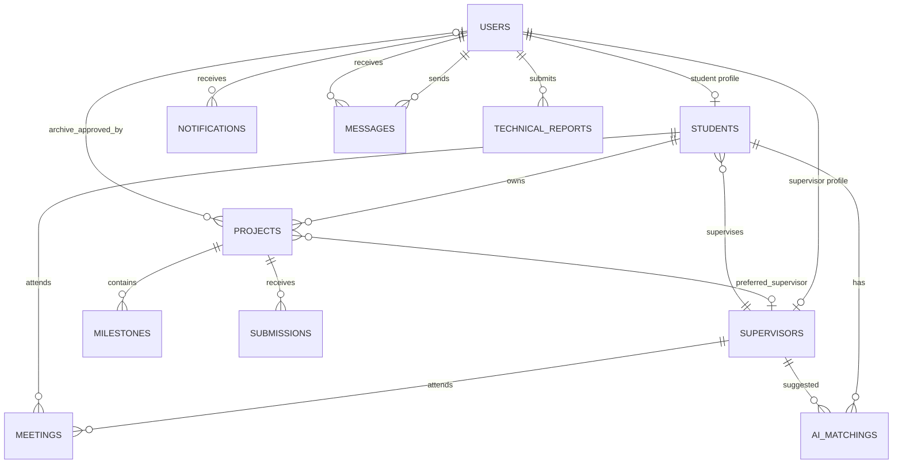

# مراجعة وتطوير بنية CapstoneHub وقاعدة البيانات

## 1. السياق التقني

- التقنية المستخدمة: Node.js + Express للباك إند، React + Vite للفرونت، FastAPI لخدمة الذكاء، PostgreSQL/pgvector لقاعدة البيانات.
- نوع قاعدة البيانات: PostgreSQL.
- حجم البيانات المتوقع: صغير إلى متوسط في مرحلة المشروع الجامعي، مع قابلية توسع لاحقة.
- المستخدمون المتزامنون المتوقعون: طلاب، مشرفون، وإدارة الجامعة ضمن نطاق كلية/جامعة.

## 2. ER Diagram وصفي



## 3. العلاقات الأساسية

- `users` هو جدول الهوية الأساسي لكل الأدوار.
- `students.user_id` علاقة One-to-One مع `users.id`.
- `supervisors.user_id` علاقة One-to-One مع `users.id`.
- `students.supervisor_id` علاقة Many-to-One مع `supervisors.user_id`.
- `projects.student_id` علاقة Many-to-One مع `students.user_id`.
- `projects.preferred_supervisor_id` علاقة Many-to-One اختيارية مع `supervisors.user_id`.
- `milestones.project_id` و `submissions.project_id` علاقات One-to-Many من المشروع.
- `messages.sender_id` و `messages.recipient_id` يربطان الرسائل بالمستخدمين.
- `notifications.user_id` يربط التنبيه بالمستخدم المستهدف.
- `meetings` جدول رابط بين الطالب والمشرف مع موعد وحالة.
- `ai_matchings` جدول رابط بين الطالب والمشرف مع درجة المطابقة.

## 4. تقييم التطبيع والقيود

قاعدة البيانات الحالية ملتزمة عملياً بـ 3NF في أغلب الجداول:

- 1NF: الأعمدة الذرية موجودة غالباً، مع استخدام arrays في `tech_stack`, `languages`, `tools`, `expertise_keywords` لأنها قوائم بحث خفيفة وليست كيانات مستقلة حالياً.
- 2NF: الجداول ذات المفاتيح الأساسية البسيطة لا تحتوي اعتماداً جزئياً.
- 3NF: بيانات المستخدم الأساسية مفصولة عن بيانات الطالب/المشرف، وبيانات المشروع مفصولة عن المراحل والملفات.

ملاحظات تحسين مستقبلية:

- إذا أصبحت القدرات واللغات قابلة للبحث المتقدم أو الإحصاء، يفضل تحويلها إلى جداول وسيطة:
  - `skills`
  - `supervisor_skills`
  - `project_skills`
- إذا احتجنا رسائل جماعية أو محادثات متعددة الأطراف، يفضل إنشاء:
  - `conversations`
  - `conversation_participants`
  - `conversation_messages`

## 5. DDL Scripts

ملف DDL الرئيسي موجود هنا:

- `db/init.sql`

أهم القيود الموجودة:

- `PRIMARY KEY` في كل الجداول الرئيسية.
- `FOREIGN KEY` بين المستخدمين والطلاب والمشرفين والمشاريع والرسائل والتنبيهات.
- `UNIQUE` على `users.email` و `students.student_id`.
- `CHECK` على الأدوار وحالات التقارير التقنية.
- `NOT NULL` للأعمدة الحرجة مثل الإيميل، كلمة المرور، الدور، اسم المستخدم، وعنوان المشروع.

أهم الفهارس الموجودة:

- `idx_users_email`
- `idx_students_student_id`
- `idx_projects_student_id`
- `idx_projects_status`
- `idx_milestones_project_id`
- `idx_submissions_project_id`
- `idx_messages_sender_id`
- `idx_messages_recipient_id`
- `idx_notifications_user_id`
- `idx_ai_matchings_student_id`
- `idx_technical_reports_student_id`
- `idx_technical_reports_status`

فهارس مقترحة لاحقاً:

```sql
CREATE INDEX IF NOT EXISTS idx_notifications_user_read_created
  ON notifications(user_id, is_read, created_at DESC);

CREATE INDEX IF NOT EXISTS idx_messages_thread_created
  ON messages(sender_id, recipient_id, created_at DESC);

CREATE INDEX IF NOT EXISTS idx_projects_archived_department
  ON projects(is_archived, created_at DESC);
```

## 6. هيكل مجلدات مقترح

الهيكل الحالي يعمل، لكنه يضع أغلب منطق الواجهة داخل `frontend/src/main.jsx`. عند التوسع يفضل التحويل تدريجياً إلى:

```text
backend/src/
  config/
    env.js
  db/
    pool.js
    repositories/
      users.repository.js
      projects.repository.js
      notifications.repository.js
  services/
    project.service.js
    notification.service.js
    supervisor.service.js
  routes/
    auth.js
    projects.js
    admin.js
  middleware/
    auth.js
    error.js
  utils/
    dates.js
    lists.js

frontend/src/
  api/
    client.js
  components/
    layout/
    feedback/
    forms/
  pages/
    student/
    supervisor/
    admin/
  features/
    messages/
    notifications/
    profile/
  hooks/
    useNotifications.js
    useSession.js
  utils/
    format.js
```

## 7. تحسينات مقترحة على الكود الحالي

الأولوية العالية:

- تقسيم `frontend/src/main.jsx` إلى صفحات ومكونات أصغر، لأنه صار الملف كبيراً ويصعب صيانته.
- إضافة Pagination لمسارات الرسائل والتنبيهات والمستخدمين والمشاريع.
- إضافة معاملات DB Transactions عند العمليات المركبة مثل اعتماد المشروع وتعيين المشرف وإرسال التنبيهات.
- إضافة طبقة Services للمنطق المتكرر مثل إرسال التنبيهات.

الأولوية المتوسطة:

- إضافة جدول `schema_migrations` أو اعتماد أداة migrations مثل Knex/Prisma/Flyway.
- تحسين نموذج الرسائل ليصبح Conversation-based عند الحاجة.
- إضافة soft delete للمستخدمين والمشاريع بدل الحذف النهائي من لوحة الإدارة.
- إضافة فهارس مركبة للصفحات كثيرة القراءة.

الأولوية المنخفضة:

- إضافة اختبارات API للعمليات الحساسة: login, confirm project, upload submission, notifications.
- توسيع Swagger ليغطي المسارات الجديدة كلها.
- إضافة rate limit مخصص لمسارات رفع الملفات والرسائل.

## 8. أمثلة كود توضيحية

### Repository Pattern

```js
// backend/src/db/repositories/projects.repository.js
import { query } from "../pool.js";

export async function findProjectForStudent(projectId, studentId) {
  const [project] = await query(
    "SELECT * FROM projects WHERE id = $1 AND student_id = $2",
    [projectId, studentId]
  );
  return project || null;
}
```

### Service Layer

```js
// backend/src/services/notifications.service.js
import { query } from "../db/pool.js";

export async function notifyUser(userId, type, message) {
  const [notification] = await query(
    "INSERT INTO notifications (user_id, type, message) VALUES ($1, $2, $3) RETURNING *",
    [userId, type, message]
  );
  return notification;
}
```

### Transaction للعمليات المركبة

```js
const client = await pool.connect();
try {
  await client.query("BEGIN");
  await client.query("UPDATE projects SET status = 'pending_review' WHERE id = $1", [projectId]);
  await client.query("INSERT INTO notifications (user_id, type, message) VALUES ($1, $2, $3)", [studentId, "project_request", message]);
  await client.query("COMMIT");
} catch (error) {
  await client.query("ROLLBACK");
  throw error;
} finally {
  client.release();
}
```

### Pagination موحد

```js
function pagination(req) {
  const limit = Math.min(Number(req.query.limit) || 30, 100);
  const page = Math.max(Number(req.query.page) || 1, 1);
  return { limit, offset: (page - 1) * limit };
}
```

## 9. خلاصة التنفيذ

المشروع حالياً يملك أساس جيد:

- علاقات قاعدة بيانات واضحة.
- استخدام Parameterized Queries ضد SQL Injection.
- فهارس أساسية موجودة.
- فصل منطقي بين أدوار الطالب والمشرف والإدارة.
- وجود Docker وملفات تشغيل واضحة.

أكثر نقطة تحتاج تطوير قريباً هي قابلية الصيانة في الواجهة، لأن `main.jsx` صار يحتوي عدداً كبيراً من الصفحات والحالات والمنطق. بعدها تأتي خطوة تنظيم الباك إند إلى Repositories/Services وإضافة migrations رسمية.
