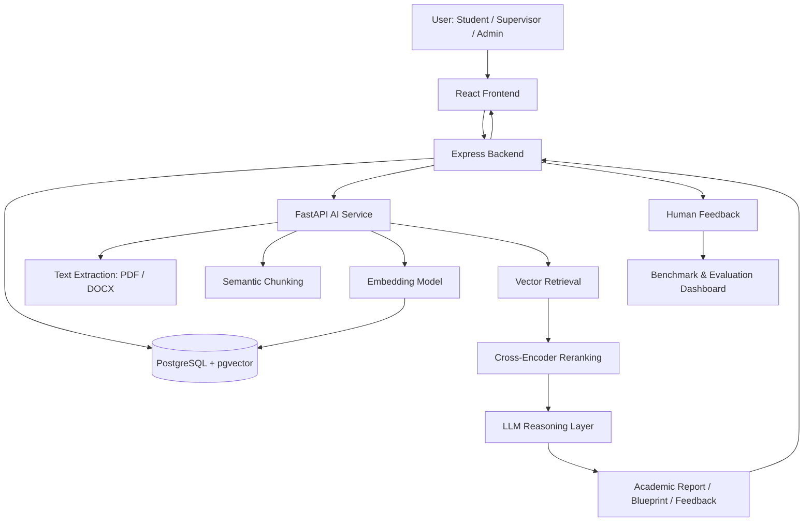

# Complete Development Plan: Graduation Project AI Assistant
## Academic RAG Framework for CapstoneHub

---

## 1. Executive Goal

Build the next version of the CapstoneHub AI assistant by upgrading the current rule-based and TF-IDF assistant into a research-grade Academic RAG system.

The upgraded assistant should support Arabic-first academic use cases:

- Semantic search over previous graduation projects.
- Supervisor and teammate recommendation.
- PDF/DOCX thesis and proposal analysis.
- Project idea novelty checking.
- Academic roadmap generation.
- AI-generated project blueprint: database tables, relationships, pages, APIs, Mermaid diagrams, MVP plan, risks, and defense questions.
- Supervisor feedback collection and research evaluation.
- Benchmark comparison between baseline TF-IDF/rule-based methods and the proposed Hybrid-RAG architecture.

This plan is designed for the current CapstoneHub architecture:

- Frontend: React + Vite.
- Backend: Node.js + Express.
- AI service: Python + FastAPI.
- Database: PostgreSQL with pgvector Docker image.
- Current AI methods: TF-IDF, cosine similarity, regex, manual rules, heuristic scoring.

---

## 2. Current System Summary

### 2.1 Existing AI Capabilities

The current project already includes a strong baseline:

- `ai-service/main.py`
  - Supervisor matching.
  - Advanced project-supervisor-student matching.
  - Concept duplication check.
  - Roadmap generation.
  - Proposal scoring.
  - Thesis analysis.
  - Thesis grading.
  - Risk prediction.

- `backend/src/routes/ai.js`
  - Authenticated bridge between Express backend and FastAPI AI service.
  - Reads project and submission files.
  - Sends base64 PDF/DOCX files to the AI service.
  - Stores AI document analyses.

- `backend/src/routes/features.js`
  - Floating assistant response logic.
  - Project blueprint generation.
  - Rule-based domain detection.
  - Benchmark execution.
  - Assistant feedback collection.
  - Excel export for research data.

- `frontend/src/components/FloatingMessages.jsx`
  - Chat-like assistant UI.
  - Blueprint display.
  - Export to Markdown, JSON, DOC, and printable PDF.
  - Feedback submission.

- `frontend/src/components/AssistantAnalytics.jsx`
  - Assistant feedback dashboard.
  - Benchmark results dashboard.
  - Research metric exports.

### 2.2 Current Limitations

The current assistant is explainable but limited:

- TF-IDF does not understand deep Arabic academic meaning.
- Regex-based analysis cannot reliably detect academic quality.
- Rule-based blueprint generation can miss uncommon domains.
- No persistent vector store is currently used, although pgvector is available in Docker.
- No semantic retrieval over old projects, rubrics, university guides, or supervisor notes.
- No reranking stage.
- No neural academic classification layer.
- No internal plagiarism pipeline.
- No rigorous comparison between baseline, embedding retrieval, Hybrid-RAG, and LLM-assisted responses.

---

## 3. Target Architecture



### Main Design

The new system should use a Hybrid-RAG pipeline:

1. Extract and normalize academic text.
2. Chunk the text semantically.
3. Generate multilingual Arabic-capable embeddings.
4. Store chunks and embeddings in PostgreSQL using pgvector.
5. Retrieve Top-K chunks using vector similarity.
6. Rerank retrieved chunks using a Cross-Encoder.
7. Inject the best context into an LLM prompt.
8. Return structured academic outputs.
9. Collect human feedback for future model improvement.

---

## 4. Development Roadmap

## Phase 0: Code Audit and Migration Plan

### Objective

Document what should be kept, refactored, removed, and added before implementation.

### Tasks

- Audit `ai-service/main.py`.
- Audit `backend/src/routes/ai.js`.
- Audit `backend/src/routes/features.js`.
- Audit `backend/src/db.js`.
- Audit frontend assistant components.
- Create an architecture decision record for the AI upgrade.

### Keep

- Authentication and role-based permissions.
- File upload/download flow.
- PDF/DOCX extraction entry points.
- Existing assistant feedback tables.
- Existing project metadata.
- Current benchmark and feedback dashboard.
- Current rule-based assistant as a baseline for research comparison.

### Refactor

- Move AI logic from one large `main.py` into modules:
  - `extractors.py`
  - `chunking.py`
  - `embeddings.py`
  - `vector_store.py`
  - `retrieval.py`
  - `reranking.py`
  - `rag.py`
  - `plagiarism.py`
  - `classification.py`
  - `evaluation.py`

- Move blueprint-generation rules from `features.js` into a dedicated service or keep them as baseline only.
- Standardize all AI responses using typed schemas.

### Remove Later

Do not immediately delete baseline features. Keep them until the new pipeline is tested.

Remove only after replacement:

- Direct TF-IDF search as the primary search method.
- Hardcoded recommendation-only flow as the final answer source.
- Duplicate standalone regex scoring where an upgraded module exists.

### Add

- pgvector schema.
- Embedding generation pipeline.
- Semantic search endpoints.
- RAG endpoints.
- Cross-Encoder reranking.
- Advanced academic file analyzer.
- MinHash/LSH plagiarism module.
- Neural section-quality classifier.
- Evaluation scripts and dashboard metrics.

### Deliverables

- `docs/AI_MIGRATION_AUDIT.md`
- `docs/AI_ARCHITECTURE_V2.md`
- Migration checklist.

### Acceptance Criteria

- Every existing AI-related endpoint has a KEEP / REFACTOR / REPLACE status.
- No production feature is removed before a tested replacement exists.
- Baseline behavior remains available for research comparison.

---

## Phase 1: pgvector Database Foundation

### Objective

Enable semantic storage and retrieval inside PostgreSQL.

### Tasks

- Enable pgvector extension.
- Add vector tables.
- Add indexes for fast search.
- Add metadata JSONB for flexible academic context.

### Proposed Tables

```sql
CREATE EXTENSION IF NOT EXISTS vector;

CREATE TABLE IF NOT EXISTS ai_documents (
  id SERIAL PRIMARY KEY,
  source_type TEXT NOT NULL,
  source_id INTEGER,
  title TEXT,
  language TEXT DEFAULT 'ar',
  metadata JSONB NOT NULL DEFAULT '{}'::jsonb,
  created_at TIMESTAMPTZ DEFAULT now()
);

CREATE TABLE IF NOT EXISTS ai_chunks (
  id SERIAL PRIMARY KEY,
  document_id INTEGER REFERENCES ai_documents(id) ON DELETE CASCADE,
  chunk_index INTEGER NOT NULL,
  content TEXT NOT NULL,
  token_count INTEGER DEFAULT 0,
  embedding vector(768),
  metadata JSONB NOT NULL DEFAULT '{}'::jsonb,
  created_at TIMESTAMPTZ DEFAULT now()
);

CREATE INDEX IF NOT EXISTS idx_ai_chunks_document_id ON ai_chunks(document_id);
CREATE INDEX IF NOT EXISTS idx_ai_chunks_metadata ON ai_chunks USING GIN(metadata);
CREATE INDEX IF NOT EXISTS idx_ai_chunks_embedding_hnsw
ON ai_chunks USING hnsw (embedding vector_cosine_ops);
```

### Source Types

- `archived_project`
- `active_project`
- `submission`
- `university_guide`
- `rubric`
- `supervisor_note`
- `assistant_feedback`

### Deliverables

- SQL migration.
- Backend database helpers.
- AI service vector-store utility.

### Acceptance Criteria

- PostgreSQL has pgvector enabled.
- Chunks can be inserted with embeddings.
- Top-K vector search returns relevant rows under 3 seconds for 1000+ projects.

---

## Phase 2: Text Extraction and Semantic Chunking

### Objective

Create a reliable document ingestion pipeline for PDF and DOCX files.

### Tasks

- Keep current PDF/DOCX extraction as baseline.
- Improve extraction metadata:
  - file type
  - page count
  - paragraph count
  - heading candidates
  - detected language
  - section boundaries
- Implement semantic chunking.

### Chunking Strategy

Use section-aware chunking:

1. Detect headings.
2. Split by academic sections when possible.
3. Split long sections into overlapping chunks.
4. Preserve section name and page range in metadata.

Recommended chunk size:

- 500 to 900 tokens per chunk.
- 80 to 150 token overlap.

### Deliverables

- `ai-service/extractors.py`
- `ai-service/chunking.py`
- Endpoint: `POST /ingest/document`

### Acceptance Criteria

- PDF and DOCX files are converted into clean chunks.
- Each chunk has metadata.
- Chunking does not break references or headings unnecessarily.

---

## Phase 3: Embedding Model Integration

### Objective

Replace TF-IDF as the main semantic search mechanism.

### Recommended Models

Start with one of:

- `intfloat/multilingual-e5-base`
- `intfloat/multilingual-e5-large`
- `sentence-transformers/paraphrase-multilingual-MiniLM-L12-v2`

Research upgrade:

- Fine-tune `Multilingual E5` or `AraBERT` using contrastive learning on graduation-project pairs.

### Tasks

- Add `sentence-transformers`.
- Create embedding utility.
- Cache embeddings.
- Store embeddings in pgvector.
- Add batch ingestion for archived projects.

### Deliverables

- `ai-service/embeddings.py`
- Endpoint: `POST /semantic/index-project`
- Endpoint: `POST /semantic/reindex-all`

### Acceptance Criteria

- A project can be embedded and stored.
- Query embedding can retrieve similar chunks.
- Results are better than TF-IDF on benchmark examples.

---

## Phase 4: Semantic Search and Hybrid Retrieval

### Objective

Build retrieval over previous projects, rubrics, guides, and notes.

### Retrieval Pipeline

```text
User Query
  -> Normalize query
  -> Generate embedding
  -> pgvector Top-K search
  -> Metadata filtering
  -> Cross-Encoder reranking
  -> Return best evidence
```

### Tasks

- Implement Top-K vector search.
- Add filters:
  - source type
  - academic year
  - department
  - supervisor
  - project status
- Add Cross-Encoder reranking.

### Cross-Encoder Candidates

- `cross-encoder/mmarco-mMiniLMv2-L12-H384-v1`
- Arabic-capable reranker if available locally.
- Fallback: weighted scoring using vector similarity + keyword overlap + metadata match.

### Deliverables

- `ai-service/retrieval.py`
- `ai-service/reranking.py`
- Endpoint: `POST /semantic/search`

### Acceptance Criteria

- Search returns relevant previous projects.
- Results include evidence snippets and source metadata.
- Precision@5 improves over TF-IDF baseline.

---

## Phase 5: RAG Reasoning Layer

### Objective

Use retrieved academic context to generate grounded answers.

### Tasks

- Add LLM integration adapter.
- Keep provider configurable:
  - OpenAI API
  - local model
  - disabled mode for offline baseline
- Build prompts for:
  - project idea improvement
  - novelty analysis
  - supervisor recommendation explanation
  - thesis feedback
  - defense questions
  - methodology suggestions
  - project blueprint refinement

### RAG Prompt Template

```text
You are an Arabic academic graduation-project assistant.
Use only the provided context when making factual claims.
If evidence is insufficient, say what is missing.

Student query:
{query}

Retrieved academic context:
{context}

Required output:
1. Short answer
2. Evidence-based analysis
3. Practical recommendations
4. Risks or missing information
5. Next steps
```

### Deliverables

- `ai-service/rag.py`
- Endpoint: `POST /rag/answer`
- Backend route: `/api/ai/rag-answer`
- Frontend assistant integration.

### Acceptance Criteria

- Answers cite retrieved project/rubric evidence.
- Assistant avoids unsupported claims.
- User receives structured Arabic output.

---

## Phase 6: Advanced Academic File Analysis

### Objective

Upgrade simple text analysis into structural academic analysis.

### Features

- Detect academic sections:
  - Abstract
  - Introduction
  - Problem Statement
  - Objectives
  - Literature Review
  - Methodology
  - Results
  - Conclusion
  - References

- Detect formatting and structure:
  - heading hierarchy
  - missing sections
  - short/weak sections
  - reference count
  - citation style hints
  - figure/table count
  - chapter order

- Generate academic feedback:
  - clarity
  - methodology completeness
  - reference adequacy
  - novelty
  - implementation feasibility

### Deliverables

- `ai-service/academic_analyzer.py`
- Endpoint: `POST /academic/analyze-document`

### Acceptance Criteria

- Analysis returns section-level feedback.
- Recommendations are actionable.
- Existing `/analyze-thesis` remains available until replaced.

---

## Phase 7: Internal Plagiarism and Similarity Detection

### Objective

Detect overlap between a submitted document and stored graduation projects.

### Algorithms

- Sentence normalization.
- Shingling.
- Jaccard similarity.
- MinHash signatures.
- Locality Sensitive Hashing.
- Optional semantic similarity using embeddings.

### Tasks

- Store sentence fingerprints.
- Compare new submissions with archived projects.
- Report similar passages with source project references.

### Deliverables

- `ai-service/plagiarism.py`
- Endpoint: `POST /academic/plagiarism-check`

### Acceptance Criteria

- Returns top similar documents.
- Returns matched passages.
- Differentiates exact overlap from semantic similarity.

---

## Phase 8: Neural Academic Classification Layer

### Objective

Add a trainable neural layer to satisfy the academic research requirement of model modification.

### Model Design

Use a Transformer encoder with a custom classification head:

```text
Input academic section
  -> Transformer encoder
  -> CLS hidden state
  -> Dropout
  -> Linear classification head
  -> Softmax quality label
```

### Labels

Possible labels:

- `weak`
- `acceptable`
- `good`
- `excellent`

Or per-rubric binary labels:

- has clear problem statement
- has measurable objectives
- has valid methodology
- has sufficient references
- has implementation details

### Tasks

- Build labeled dataset from supervisor feedback.
- Add training script.
- Add inference endpoint.
- Compare classifier output with rule-based baseline.

### Deliverables

- `ai-service/classification.py`
- `ai-service/train_section_classifier.py`
- Endpoint: `POST /academic/classify-section`

### Acceptance Criteria

- Classifier trains successfully on sample data.
- Reports accuracy, F1-score, precision, recall.
- Integrated into document analysis report.

---

## Phase 9: Feedback Loop and Research Data Collection

### Objective

Use human feedback to evaluate and improve the assistant.

### Tasks

- Keep current assistant feedback.
- Add fields for:
  - evidence quality
  - academic usefulness
  - correctness
  - hallucination risk
  - supervisor acceptance
- Track which pipeline generated the answer:
  - baseline_rules
  - tfidf
  - embeddings
  - hybrid_rag
  - rag_llm

### Deliverables

- Database migration for feedback metadata.
- Dashboard updates.
- Exportable Excel/CSV research dataset.

### Acceptance Criteria

- Each assistant answer can be evaluated.
- Feedback is linked to model version and pipeline type.
- Research exports are available for paper analysis.

---

## Phase 10: Evaluation Dashboard and Benchmarks

### Objective

Measure the new architecture against the current baseline.

### Metrics

Retrieval:

- Precision@K
- Recall@K
- MRR
- NDCG
- Response time

Classification:

- Accuracy
- F1-score
- Precision
- Recall

Document analysis:

- Section detection accuracy
- Citation detection accuracy
- Supervisor usefulness score

RAG response:

- Groundedness
- Relevance
- Completeness
- User satisfaction
- Hallucination rate

### Experiments

Compare:

1. Rule-based baseline.
2. TF-IDF baseline.
3. Embedding retrieval.
4. Embedding retrieval + reranking.
5. Hybrid-RAG + LLM.
6. Fine-tuned embeddings + Hybrid-RAG.

### Deliverables

- `ai-service/evaluation.py`
- Backend endpoint: `/api/features/assistant-benchmark-v2`
- Frontend dashboard update.

### Acceptance Criteria

- Dashboard shows before/after results.
- Metrics are exportable.
- Results can be used directly in the research paper.

---

## Phase 11: Frontend Integration

### Objective

Expose the new AI capabilities without making the interface complicated.

### UI Updates

- Add semantic search page.
- Add RAG answer mode inside floating assistant.
- Add document analysis report view.
- Add plagiarism report view.
- Add supervisor evidence panel.
- Add AI pipeline label: baseline / semantic / RAG.
- Add confidence and evidence snippets.

### Deliverables

- Update `FloatingMessages.jsx`.
- Update student dashboard.
- Update supervisor dashboard.
- Update `AssistantAnalytics.jsx`.

### Acceptance Criteria

- Students can ask project questions.
- Supervisors can inspect evidence and compare projects.
- Admins can view benchmark results.

---

## Phase 12: Deployment and Performance

### Objective

Make the upgraded AI system reliable in Docker.

### Tasks

- Update `ai-service/requirements.txt`.
- Add model cache volume.
- Add environment variables:
  - `EMBEDDING_MODEL`
  - `RERANKER_MODEL`
  - `LLM_PROVIDER`
  - `OPENAI_API_KEY`
  - `RAG_TOP_K`
  - `RAG_RERANK_TOP_N`
- Add background ingestion job.
- Add health checks for model loading.

### Performance Targets

- Search response under 3 seconds.
- RAG response under 10 seconds depending on LLM provider.
- Batch ingestion can run asynchronously.
- System supports 1000+ archived projects.

### Acceptance Criteria

- Docker Compose runs all services.
- AI service starts without blocking forever on model downloads.
- Semantic search works after indexing.

---

## 5. API Endpoint Plan

### Existing Endpoints to Keep Temporarily

- `POST /match`
- `POST /match-advanced`
- `POST /concept-check`
- `POST /roadmap`
- `POST /score-proposal`
- `POST /analyze-thesis`
- `POST /grade-thesis`
- `POST /risk`
- `POST /risk-batch`

### New FastAPI Endpoints

- `POST /ingest/document`
- `POST /semantic/index-project`
- `POST /semantic/reindex-all`
- `POST /semantic/search`
- `POST /rag/answer`
- `POST /academic/analyze-document`
- `POST /academic/plagiarism-check`
- `POST /academic/classify-section`
- `GET /evaluation/rag-benchmark`

### New Express Routes

- `POST /api/ai/semantic-search`
- `POST /api/ai/rag-answer`
- `POST /api/ai/reindex-project/:projectId`
- `POST /api/ai/plagiarism/:submissionId`
- `GET /api/features/assistant-benchmark-v2`

---

## 6. Library Plan

### Python AI Service

Add:

- `sentence-transformers`
- `transformers`
- `torch`
- `psycopg[binary]` or `asyncpg`
- `pgvector`
- `datasketch`
- `rank-bm25` optional hybrid lexical fallback
- `tiktoken` or tokenizer-specific counting utility
- `python-multipart` if direct file upload is added

Keep:

- `fastapi`
- `uvicorn`
- `numpy`
- `pypdf`
- `python-docx`
- `scikit-learn` for baseline comparison and metrics

### Backend

Keep:

- Express routes.
- Existing auth middleware.
- Existing database helper.
- Existing upload handling.

Add only if needed:

- Background job utilities.
- CSV/XLSX export improvements.

---

## 7. Database Migration Plan

### Step 1

Enable pgvector and add AI document/chunk tables.

### Step 2

Add model version tracking:

```sql
CREATE TABLE IF NOT EXISTS ai_model_runs (
  id SERIAL PRIMARY KEY,
  pipeline_type TEXT NOT NULL,
  model_name TEXT,
  model_version TEXT,
  input_hash TEXT,
  output JSONB NOT NULL DEFAULT '{}'::jsonb,
  metrics JSONB NOT NULL DEFAULT '{}'::jsonb,
  created_at TIMESTAMPTZ DEFAULT now()
);
```

### Step 3

Extend feedback:

```sql
ALTER TABLE assistant_feedback
ADD COLUMN IF NOT EXISTS pipeline_type TEXT,
ADD COLUMN IF NOT EXISTS model_name TEXT,
ADD COLUMN IF NOT EXISTS evidence_score INTEGER,
ADD COLUMN IF NOT EXISTS correctness_score INTEGER,
ADD COLUMN IF NOT EXISTS hallucination_risk INTEGER;
```

---

## 8. Research Paper Structure

### Title

Hybrid Retrieval-Augmented Generation Framework for Arabic Graduation Project Support and Academic Monitoring

### Sections

1. Abstract
2. Introduction
3. Problem Statement
4. Related Work
5. Existing Baseline System
6. Proposed Hybrid-RAG Architecture
7. Semantic Chunking and Embedding Pipeline
8. Cross-Encoder Reranking Method
9. Neural Academic Classification Layer
10. Structural and Integrity Analysis
11. Experimental Setup
12. Dataset and Annotation Process
13. Evaluation Metrics
14. Results and Discussion
15. Limitations
16. Conclusion and Future Work

---

## 9. Suggested Timeline

### Week 1

- Code audit.
- Database migration.
- AI module refactor plan.

### Week 2

- Text extraction improvements.
- Semantic chunking.
- pgvector insert/search utilities.

### Week 3

- Embedding model integration.
- Archived project indexing.
- Semantic search endpoint.

### Week 4

- Cross-Encoder reranking.
- RAG prompt design.
- First RAG answer endpoint.

### Week 5

- Document analysis upgrade.
- Citation and structure checks.
- Frontend report view.

### Week 6

- Plagiarism detection with MinHash/LSH.
- Similarity report.
- Supervisor-facing evidence panel.

### Week 7

- Classification head prototype.
- Training script.
- Evaluation metrics.

### Week 8

- Benchmark v2.
- Dashboard updates.
- Research export.

### Week 9

- Polish UX.
- Performance testing.
- Docker deployment validation.

### Week 10

- Research paper writing.
- Results tables.
- Architecture diagrams.
- Final defense material.

---

## 10. Definition of Done

The development is complete when:

- The old baseline assistant still works for comparison.
- Semantic search over archived projects works through pgvector.
- RAG answers include retrieved evidence.
- Thesis/proposal analysis includes structure, references, and recommendations.
- Plagiarism/similarity report is available.
- Classification layer can be trained and evaluated.
- Dashboard compares baseline vs proposed architecture.
- Feedback is linked to pipeline type and model version.
- Research paper has measurable results using recognized metrics.

---

## 11. Implementation Priority

Recommended order:

1. Phase 0: Audit and migration plan.
2. Phase 1: pgvector schema.
3. Phase 2: chunking and extraction.
4. Phase 3: embeddings.
5. Phase 4: semantic search.
6. Phase 5: RAG answer endpoint.
7. Phase 10: benchmark v2.
8. Phase 6: advanced document analysis.
9. Phase 7: plagiarism.
10. Phase 8: classification head.
11. Phase 11: frontend polish.
12. Phase 12: deployment hardening.

This order gives the project a working semantic AI upgrade early, while leaving the more research-heavy components for controlled implementation and evaluation.
